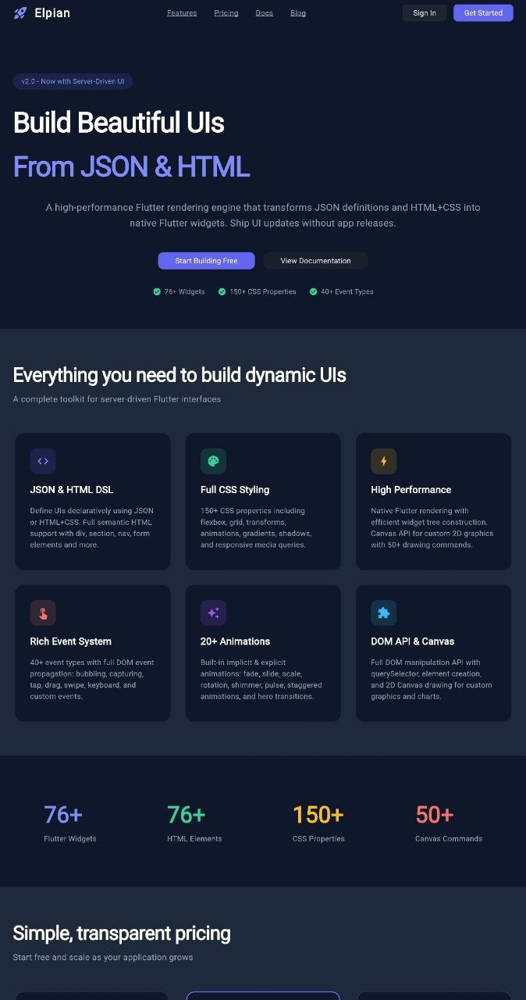
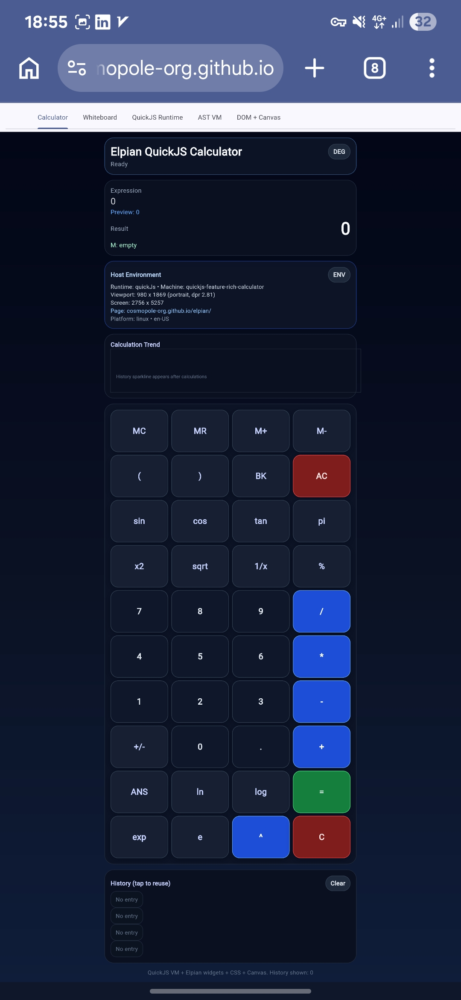
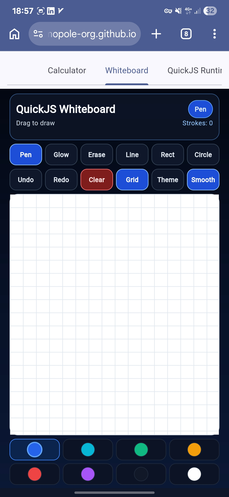
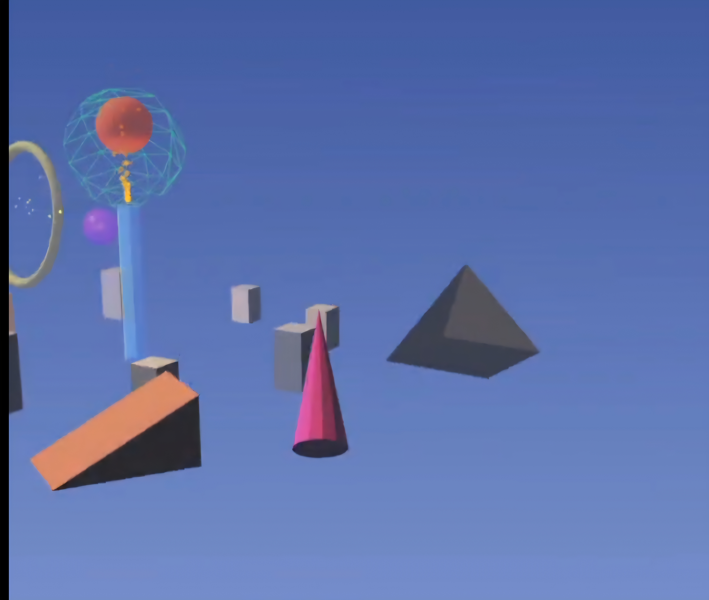

<p align="center">
  <h1 align="center">Elpian UI</h1>
  <p align="center">
    <strong>A high-performance Flutter engine that renders HTML, CSS, Flutter DSL, Canvas 2D, and 3D scene graphs from JSON into native widgets.</strong>
  </p>
  <p align="center">
    <a href="#-quick-start">Quick Start</a> &bull;
    <a href="#-features">Features</a> &bull;
    <a href="#-code-examples">Examples</a> &bull;
    <a href="#-documentation">Docs</a> &bull;
    <a href="#-platform-support">Platforms</a>
  </p>
</p>

---

Define your entire UI in JSON. Render it natively in Flutter. Elpian bridges the gap between web-style markup and native mobile/desktop performance &mdash; supporting everything from simple layouts to full 3D scenes and scripted application logic.

```dart
final widget = ElpianEngine().renderFromJson({
  'type': 'div',
  'style': {'padding': '24', 'backgroundColor': '#1E1E2E', 'borderRadius': 16},
  'children': [
    {'type': 'h1', 'props': {'text': 'Hello, Elpian'}, 'style': {'color': '#CDD6F4', 'fontSize': 28}}
  ]
});
```

## At a Glance

| | |
|---|---|
| **201** Dart source files | **17** Rust source files |
| **60+** Flutter widgets | **70+** HTML5 elements |
| **150+** CSS properties | **50+** Canvas 2D commands |
| **40+** event types | **22** animation widgets |
| **6** platforms supported | **13** example apps included |

---

## 🖼️ Demo Screenshots

<p align="center">
  
  
  
</p>

<p align="center">
  
</p>

> These screenshots highlight real Elpian examples: landing UI rendering, QuickJS calculator + whiteboard, 3D scene graph rendering, and Canvas API primitives.

---

## &#x2728; Features

### &#x1F3D7;&#xFE0F; Rendering Engines

| Engine | Description |
|--------|-------------|
| **Flutter DSL** | 60+ Flutter widgets rendered from JSON &mdash; layout, controls, animation, interaction |
| **HTML Rendering** | 70+ HTML5 semantic elements &mdash; `div`, `section`, `form`, `table`, `video`, and more |
| **CSS Engine** | 150+ CSS properties &mdash; flexbox, grid, transforms, animations, filters, variables |
| **Canvas 2D** | Full 2D graphics API with paths, shapes, gradients, text, and transforms |
| **3D Scenes** | An embedded **Godot 4** engine as a `Scene3D` widget, driven reflectively |
| **Elpian VM** | Sandboxed Rust bytecode VM with FFI (native) and WASM (web) for scripting UI logic |
| **Next.js Bridge** | Server-driven Next.js payloads (`component` + `stylesheet`) rendered natively by Elpian clients |

### &#x2699;&#xFE0F; Core Systems

- **JSON Stylesheets** &mdash; CSS-like rules in JSON with media queries, variables, keyframe animations, and cascade
- **DOM API** &mdash; `getElementById`, `querySelector`, `appendChild`, style & class management, and more
- **Event System** &mdash; 40+ event types with capturing, bubbling, delegation, debounce, and throttle
- **Widget Registry** &mdash; 200+ pre-registered builders, plus custom widget registration
- **QuickJS Runtime** &mdash; Embedded JavaScript engine for scripting alongside the Rust VM

---

## &#x1F680; Quick Start

### Installation

Add Elpian to your `pubspec.yaml`:

```yaml
dependencies:
  elpian_ui:
    path: ./path/to/elpian
```

```bash
flutter pub get
```

### Run the demo

```bash
flutter run -t lib/example/landing_page_example.dart
```

---

## &#x1F4BB; Code Examples


### Next.js Black-Box Client

```dart
const NextjsServerWidget(
  serverBaseUrl: 'https://mini.example.com',
  route: '/',
);
```

This mode uses your Next.js server as the UI source and fetches real Next.js routes by default (not only a single API endpoint), then renders returned Elpian components natively on the client with `NextjsLink` + server navigation commands. Routes can also return `jsCode` + `jsEntryFunction` (default `MainComponent`) and `vmAstJson`; scripts can call host `render` to push UI DSL from code. Server payloads may also use `type: "clientComp"` with inline `jsCode`.

### Caspar point-signaling machine (Node.js + Docker example)

A complete VM-oriented machine example is available at `example/caspar-node-machine/`. It demonstrates how a Caspar machine program can use host-imported point signaling APIs to broadcast Elpian runtime mode selection (`nextjs_server`, `streaming_server`, or `fully_client_side`), then push `ui.init` and incremental `ui.patch` packets without exposing its own HTTP/WebSocket transport.

### Render UI from JSON

```dart
import 'package:elpian_ui/elpian_ui.dart';

final engine = ElpianEngine();

final widget = engine.renderFromJson({
  'type': 'div',
  'style': {
    'padding': '20',
    'backgroundColor': '#2196F3',
    'borderRadius': 12,
    'boxShadow': [{'color': 'rgba(0,0,0,0.2)', 'offset': {'x': 0, 'y': 4}, 'blur': 8}]
  },
  'children': [
    {
      'type': 'h1',
      'props': {'text': 'Hello World'},
      'style': {'color': 'white', 'fontSize': 32, 'fontWeight': 'bold'}
    }
  ]
});
```

### JSON Stylesheets

```dart
engine.loadStylesheet({
  'rules': [
    {
      'selector': '.card',
      'styles': {
        'backgroundColor': '#FFFFFF',
        'padding': '20',
        'borderRadius': 12,
        'boxShadow': [{'color': 'rgba(0,0,0,0.1)', 'offset': {'x': 0, 'y': 2}, 'blur': 8}],
      }
    },
    {
      'selector': '.btn-primary',
      'styles': {'backgroundColor': '#2196F3', 'color': '#FFFFFF', 'padding': '12 24'}
    }
  ],
  'mediaQueries': [
    {
      'query': 'min-width: 768',
      'rules': [{'selector': '.card', 'styles': {'padding': '40'}}]
    }
  ]
});

final ui = engine.renderFromJson({
  'type': 'div',
  'props': {'className': 'card'},
  'children': [
    {'type': 'Button', 'props': {'text': 'Click Me', 'className': 'btn-primary'}}
  ]
});
```

### Event Handling

```dart
engine.setGlobalEventHandler((event) {
  print('Event: ${event.type} on ${event.target}');
  if (event is ElpianPointerEvent) {
    print('Position: ${event.position}');
  }
});

final widget = engine.renderFromJson({
  'type': 'Button',
  'key': 'my-button',
  'props': {'text': 'Click Me'},
  'events': {
    'click': (event) { /* handle click */ },
    'longpress': (event) { /* handle long press */ }
  }
});
```

### DOM Manipulation

```dart
final dom = ElpianDOM();
final container = dom.createElement('div', id: 'main', classes: ['container']);
final title = dom.createElement('h1');
title.textContent = 'Dynamic Content';
title.setStyle('color', '#2196F3');
container.appendChild(title);

final element = dom.getElementById('main');
element?.addClass('active');
element?.addEventListener('click', () => print('Clicked!'));

// Convert to renderable widget
final node = element?.toElpianNode();
```

### 3D Scenes — embedded Godot

3D is a real **Godot 4** engine embedded as a `Scene3D` widget. Build the world
declaratively and drive it afterwards with the full reflective Godot API:

```dart
Scene3D(
  initialScene: const {
    'environment': {'bg': '#0d1117'},
    'camera':      {'position': [0, 3, 8], 'rotation': [-18, 0, 0], 'fov': 55},
    'lights':  [{'type': 'directional', 'shadow': true, 'rotation': [-50, -30, 0]}],
    'nodes':   [{'type': 'mesh', 'shape': 'torus', 'id': 'ring', 'color': '#6699ff'}],
  },
  onReady: (scene) => scene.require('ring').set('scale', const Vector3(1.4, 1.4, 1.4)),
)
```

Coverage is complete by construction: the engine side runs a *reflective*
interpreter addressing Godot by name through `ClassDB`, so every node class,
method, property and signal is reachable — including ones added in future Godot
versions. Where no Godot artifact is present, `Scene3D` renders a placeholder and
the surrounding 2D app is unaffected.

See [`wiki/11-canvas-and-3d.md`](wiki/11-canvas-and-3d.md).

### VM-Driven UI

#### QuickJS runtime sample (`ElpianRuntime.quickJs`)

```dart
ElpianVmWidget.fromCode(
  machineId: 'quickjs-counter-demo',
  runtime: ElpianRuntime.quickJs,
  code: r'''
let count = 0;

function renderCounter() {
  askHost('render', JSON.stringify({
    type: 'Column',
    props: { style: { padding: '20', backgroundColor: '#f5f7ff' } },
    children: [
      { type: 'Text', props: { text: `QuickJS Count: ${count}` } },
      { type: 'Button', props: { text: 'Increment' }, events: { tap: 'increment' } }
    ]
  }));
}

function increment() {
  count += 1;
  askHost('println', `Count changed to ${count}`);
  renderCounter();
}

renderCounter();
''',
)
```

#### Elpian AST VM sample (`ElpianRuntime.elpian`)

```dart
ElpianVmWidget.fromAst(
  machineId: 'vm-ast-counter',
  astJson: jsonEncode({
    'type': 'program',
    'data': {'body': [
      {
        'type': 'definition',
        'data': {
          'leftSide': {
            'type': 'identifier',
            'data': {'name': 'view'}
          },
          'rightSide': {
            'type': 'object',
            'data': {
              'value': {
                'type': {'type': 'string', 'data': {'value': 'Text'}},
                'props': {
                  'type': 'object',
                  'data': {
                    'value': {
                      'text': {
                        'type': 'string',
                        'data': {'value': 'Hello from Elpian AST VM!'}
                      }
                    }
                  }
                }
              }
            }
          }
        }
      },
      {
        'type': 'host_call',
        'data': {
          'name': 'render',
          'args': [
            {'type': 'identifier', 'data': {'name': 'view'}}
          ]
        }
      }
    ]}
  }),
)
```

### Custom Widget Registration

```dart
engine.registerWidget('MyCustomCard', (node, children) {
  return Container(
    padding: const EdgeInsets.all(16),
    decoration: BoxDecoration(
      color: Colors.white,
      borderRadius: BorderRadius.circular(12),
      boxShadow: [
        BoxShadow(color: Colors.black.withOpacity(0.1), blurRadius: 8, offset: const Offset(0, 4)),
      ],
    ),
    child: Column(children: children),
  );
});
```

---

## &#x1F9E9; Widget & Element Coverage

<details>
<summary><strong>&#x1F4D0; Layout Widgets (30+)</strong></summary>

Container, Column, Row, Stack, Positioned, Expanded, Flexible, Wrap, Center, Align, Padding, SizedBox, AspectRatio, FractionallySizedBox, FittedBox, LimitedBox, ConstrainedBox, OverflowBox, Baseline, Spacer, IndexedStack, RotatedBox, DecoratedBox, ClipRRect

</details>

<details>
<summary><strong>&#x1F39B;&#xFE0F; UI Controls (15+)</strong></summary>

Button, TextField, Checkbox, Radio, Switch, Slider, Chip, Badge, CircularProgressIndicator, LinearProgressIndicator, Divider, VerticalDivider

</details>

<details>
<summary><strong>&#x1F3AC; Animation Widgets (22)</strong></summary>

AnimatedContainer, AnimatedOpacity, AnimatedCrossFade, AnimatedSwitcher, AnimatedAlign, AnimatedPadding, AnimatedPositioned, AnimatedScale, AnimatedRotation, AnimatedSlide, AnimatedSize, AnimatedDefaultTextStyle, AnimatedGradient, FadeTransition, SlideTransition, ScaleTransition, RotationTransition, SizeTransition, TweenAnimationBuilder, StaggeredAnimation, Shimmer, Pulse

</details>

<details>
<summary><strong>&#x1F446; Interaction Widgets (10+)</strong></summary>

InkWell, GestureDetector, Tooltip, Dismissible, Draggable, DragTarget, Opacity, Transform, Hero

</details>

<details>
<summary><strong>&#x1F310; HTML5 Elements (70+)</strong></summary>

**Document:** div, span, section, article, header, footer, nav, aside, main

**Typography:** h1-h6, p, strong, em, mark, small, del, ins, sub, sup, abbr, cite, kbd, samp, var, code, pre, blockquote, br, hr, time, data

**Lists:** ul, ol, li &bull; **Tables:** table, tr, td, th

**Forms:** form, input, button, select, option, optgroup, textarea, label, fieldset, legend, datalist, output, progress, meter

**Media:** img, picture, source, figure, figcaption, video, audio, track, canvas, iframe, embed, object, param, map, area

**Interactive:** a, details, summary, dialog

</details>

<details>
<summary><strong>&#x1F3A8; CSS Properties (150+)</strong></summary>

**Box Model (25):** width, height, min/max dimensions, padding, margin, box-sizing, overflow

**Positioning (10):** position (relative/absolute/fixed/sticky), top, right, bottom, left, z-index, float, clear

**Flexbox (20):** display, flex-direction, flex-wrap, justify-content, align-items, align-content, align-self, gap, order, flex-grow/shrink/basis

**Grid (15):** grid-template-columns/rows/areas, grid-auto-columns/rows/flow, grid-column/row/area, grid-gap, justify-items/self

**Typography (25):** color, font-size/weight/style/family, letter-spacing, word-spacing, line-height, text-align/decoration/transform/overflow, white-space

**Background (10):** background-color/image/size/position/repeat/attachment/clip/origin, linear & radial gradients

**Border (20):** border, border-width/style/color per side, border-radius per corner, outline, border-collapse/spacing

**Transform (20):** rotate, scale, translate, skew per axis, perspective, transform-origin/style, backface-visibility

**Effects (15):** opacity, visibility, box-shadow, text-shadow, drop-shadow, blur, brightness, contrast, grayscale, hue-rotate, invert, saturate, sepia, backdrop-blur

**Animation (12):** transition-duration/delay/property/timing-function, animation-name/duration/delay/timing-function/iteration-count/direction/fill-mode/play-state

</details>

---

## &#x1F30D; Platform Support

| Platform | 2D / HTML / CSS | Canvas 2D | 3D (embedded Godot) | VM |
|:--------:|:---------------:|:---------:|:-------------------:|:--:|
| Android | &#x2705; | &#x2705; | &#x2705; platform view | &#x2705; FFI |
| iOS | &#x2705; | &#x2705; | &#x2705; platform view | &#x2705; FFI |
| Web | &#x2705; | &#x2705; | placeholder | &#x2705; WASM |
| macOS | &#x2705; | &#x2705; | placeholder | &#x2705; FFI |
| Linux | &#x2705; | &#x2705; | placeholder | &#x2705; FFI |
| Windows | &#x2705; | &#x2705; | placeholder | &#x2705; FFI |

3D needs the `godot/` plugin plus its binary artifacts; without them `Scene3D`
degrades to a placeholder rather than failing.

---

## &#x1F4C1; Project Structure

```
elpian/
├── lib/
│   ├── elpian_ui.dart              # Main library export
│   ├── src/
│   │   ├── core/                   # Engine, widget registry, event system, DOM API
│   │   ├── models/                 # ElpianNode, CSSStyle data models
│   │   ├── parser/                 # JSON parser
│   │   ├── css/                    # CSS parser, stylesheets, JSON stylesheet engine
│   │   ├── canvas/                 # 2D Canvas API
│   │   ├── widgets/                # 60+ Flutter widget builders
│   │   ├── html_widgets/           # 70+ HTML element builders
│   │   ├── godot/                  # Embedded Godot 3D: Scene3D + op protocol
│   │   ├── scope/                  # Re-render boundaries
│   │   ├── integrations/           # Next.js + server-driven rendering adapters
│   │   └── vm/                     # Elpian VM + QuickJS integration
│   └── example/                    # 13 demo applications
├── rust/                           # Rust VM workspace: VM, js2elpian, dart2elpian,
│                                   #   dart, capi, guest preludes
├── cli/                            # The `elpian` CLI + its Flutter web shell
├── godot/                          # Embedded-Godot plugin (Android + iOS)
├── wiki/                           # All documentation
├── rust_builder/                   # Flutter FFI plugin (all platforms)
├── test/                           # Unit & integration tests
├── web/                            # Web assets, WASM loader, PWA manifest
├── .github/workflows/              # CI/CD: build WASM + deploy to GitHub Pages
└── pubspec.yaml
```

---

## &#x1F4D6; Documentation

All documentation now lives in **[`wiki/`](wiki/)** — a single, current set of
chapters written to be read start-to-finish or dipped into. The scattered
root-level documents it replaced are gone; what was still true in them was
folded in.

| Chapter | Read it when you need to… |
|:--------|:--------------------------|
| [`wiki/README.md`](wiki/README.md) | Find your way in — start here |
| [`01-architecture.md`](wiki/01-architecture.md) | Understand the layers and the repo map |
| [`02-elpian-vm.md`](wiki/02-elpian-vm.md) | Know how the VM executes |
| [`03-governance.md`](wiki/03-governance.md) | Sandbox untrusted code |
| [`04-languages.md`](wiki/04-languages.md) | Write guest TypeScript / JS / Dart |
| [`05-cli.md`](wiki/05-cli.md) | Drive the `elpian` CLI |
| [`06-templates.md`](wiki/06-templates.md) | Pick a project template |
| [`07-ui-model.md`](wiki/07-ui-model.md) | Emit UI from a guest program |
| [`08-widgets.md`](wiki/08-widgets.md) | Pick a widget or HTML tag |
| [`09-styling.md`](wiki/09-styling.md) | Style it — CSS, stylesheets, media queries |
| [`10-events.md`](wiki/10-events.md) | Handle input |
| [`11-canvas-and-3d.md`](wiki/11-canvas-and-3d.md) | Draw 2D, or embed Godot via `Scene3D` |
| [`12-host-apis.md`](wiki/12-host-apis.md) | Call the host / write custom handlers |
| [`13-recipes.md`](wiki/13-recipes.md) | Copy working patterns |
| [`14-gotchas.md`](wiki/14-gotchas.md) | **The mistakes to never make** |
| [`15-ast-reference.md`](wiki/15-ast-reference.md) | Look up an AST node or VM API |
| [`16-widget-reference.md`](wiki/16-widget-reference.md) | Look up a widget prop or CSS property |
| [`17-nextjs-integration.md`](wiki/17-nextjs-integration.md) | Render Next.js server payloads |

---

## &#x1F527; Use Cases

- **&#x2601;&#xFE0F; Server-Driven UI** &mdash; Render complete interfaces from backend JSON configs
- **&#x1F4DD; Dynamic Forms** &mdash; Generate forms from schema definitions at runtime
- **&#x1F4F0; Content Management** &mdash; Render CMS content with full CSS styling
- **&#x1F500; A/B Testing** &mdash; Switch UI variants without shipping app updates
- **&#x1F3D7;&#xFE0F; No-Code Builders** &mdash; Visual UI builders that output JSON for Elpian to render
- **&#x1F4CA; 3D Visualization** &mdash; Product viewers, data viz, interactive scenes
- **&#x1F4DC; Scripted Applications** &mdash; VM-driven apps with dynamic logic and rendering

---

## &#x1F3C3; Running Tests

```bash
flutter test
```

---

## &#x1F4C4; License

MIT License
