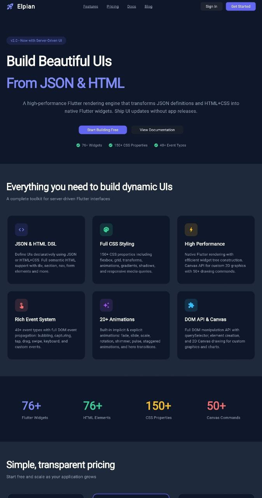
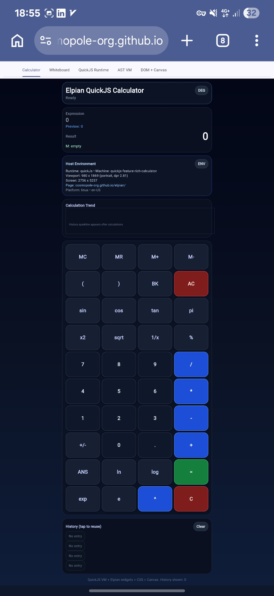
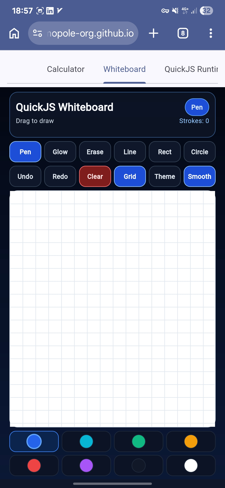
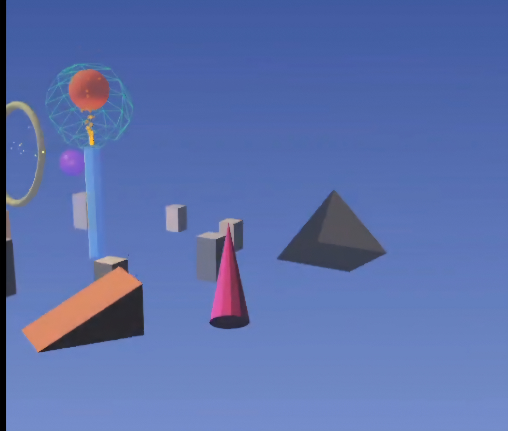

<p align="center">
  <h1 align="center">Elpian UI</h1>
  <p align="center">
    <strong>Mini apps defined as JSON or produced by a sandboxed VM &mdash; HTML, CSS, Flutter DSL, Canvas 2D and embedded Godot 3D &mdash; rendered natively, by Flutter or by each platform's own UI toolkit.</strong>
  </p>
  <p align="center">
    <a href="#-quick-start">Quick Start</a> &bull;
    <a href="#-features">Features</a> &bull;
    <a href="#-code-examples">Examples</a> &bull;
    <a href="#-documentation">Docs</a> &bull;
    <a href="#-platform-support">Platforms</a>
  </p>
</p>

---

Define your entire UI in JSON, or emit it from a sandboxed Elpian VM, QuickJS or WASM program. Elpian bridges the gap between web-style markup and native performance &mdash; supporting everything from simple layouts to full 3D scenes and scripted application logic.

The same mini apps run in two host modes:

| Host mode | Where | Renders to | Embed with |
|---|---|---|---|
| **Flutter host** | [`flutter/`](flutter/) (`elpian_ui`) | Flutter widgets &mdash; Android, iOS, web, macOS, Linux, Windows | `ElpianEngine`, `ElpianVmWidget`, `NextjsServerWidget`, &hellip; |
| **Native hosts** | [`native/`](native/) | Android Views (Kotlin), UIKit (Swift), the DOM (TypeScript), Expo / React Native | `ElpianHostView.open(kind, options)`, `mountElpian(el, kind, options)`, `<ElpianView>` |

Both modes share the node format, the HTML and Flutter widget sets, CSS, canvas,
`Scene3D`, the host-call API and the runtimes. The native engines are Kotlin,
Swift and TypeScript ports of one engine, tested against it &mdash; see
[wiki/23-native-hosts.md](wiki/23-native-hosts.md).

Flutter host:

```dart
final widget = ElpianEngine().renderFromJson({
  'type': 'div',
  'style': {'padding': '24', 'backgroundColor': '#1E1E2E', 'borderRadius': 16},
  'children': [
    {'type': 'h1', 'props': {'text': 'Hello, Elpian'}, 'style': {'color': '#CDD6F4', 'fontSize': 28}}
  ]
});
```

Native host (web shown; Android and iOS open the same session kinds on an `ElpianHostView`):

```js
import { installElpian, mountElpian } from '@elpian/web';

installElpian({ assetBase: '/node_modules/@elpian/web/assets/' });
await mountElpian(document.getElementById('app'), 'json', {
  view: {
    type: 'div',
    style: { padding: '24', backgroundColor: '#1E1E2E', borderRadius: 16 },
    children: [{ type: 'h1', props: { text: 'Hello, Elpian' }, style: { color: '#CDD6F4', fontSize: 28 } }],
  },
});
```

## At a Glance

| | |
|---|---|
| **230+** Dart files (Flutter host) | **130** Rust files (VM, compilers, server) |
| **70+** TypeScript, **80+** Kotlin, **80+** Swift files (native hosts) | **4** native targets: Android, iOS, Web, Expo |
| **60+** Flutter widgets | **70+** HTML5 elements |
| **150+** CSS properties | **50+** Canvas 2D commands |
| **40+** event types | **22** animation widgets |
| **6** Flutter platforms | **12** Flutter example screens |

---

## 🖼️ Demo Screenshots

<p align="center">
  
  
  
</p>

<p align="center">
  
</p>

> These screenshots highlight real Elpian examples: landing UI rendering, QuickJS calculator + whiteboard, 3D scene graph rendering, and Canvas API primitives.

---

## &#x2728; Features

### &#x1F3D7;&#xFE0F; Rendering Engines

| Engine | Description |
|--------|-------------|
| **Flutter DSL** | 60+ Flutter widgets rendered from JSON &mdash; layout, controls, animation, interaction |
| **HTML Rendering** | 70+ HTML5 semantic elements &mdash; `div`, `section`, `form`, `table`, `video`, and more |
| **CSS Engine** | 150+ CSS properties &mdash; flexbox, grid, transforms, animations, filters, variables |
| **Canvas 2D** | Full 2D graphics API with paths, shapes, gradients, text, and transforms |
| **3D Scenes** | An embedded **Godot 4** engine as a `Scene3D` widget, driven reflectively |
| **Elpian VM** | Sandboxed Rust bytecode VM with FFI / JNI (native) and WASM (web) for scripting UI logic |
| **Next.js Bridge** | Server-driven Next.js payloads (`component` + `stylesheet`) rendered natively by Elpian clients |
| **Two host modes** | The Flutter host (`flutter/`) and native hosts (`native/`: Android Views, UIKit, DOM, Expo) for the same mini apps |

### &#x2699;&#xFE0F; Core Systems

- **JSON Stylesheets** &mdash; CSS-like rules in JSON with media queries, variables, keyframe animations, and cascade
- **DOM API** &mdash; `getElementById`, `querySelector`, `appendChild`, style & class management, and more
- **Event System** &mdash; 40+ event types with capturing, bubbling, delegation, debounce, and throttle
- **Widget Registry** &mdash; 200+ pre-registered builders, plus custom widget registration
- **QuickJS Runtime** &mdash; Embedded JavaScript engine for scripting alongside the Rust VM (JavaScriptCore on the native iOS host)
- **Sessions** &mdash; native hosts expose `json`, `miniapp`, `superapp`, `stream`, `nextjs` and `server` sessions with the same methods and events on every platform

---

## &#x1F680; Quick Start

### A mini app project (CLI)

```bash
elpian create my_app                       # Flutter web shell (default)
elpian create my_app --renderer native     # or the @elpian/web DOM host
cd my_app && elpian run install && elpian run dev
```

`elpian.config.json`'s `"renderer"` (`"flutter"` | `"native"`) picks what
`elpian run build` writes to `dist/web`; `--renderer` overrides it per run. See
[wiki/05-cli.md](wiki/05-cli.md).

### Flutter host

Add the package in [`flutter/`](flutter/) to your `pubspec.yaml`:

```yaml
dependencies:
  elpian_ui:
    path: ./path/to/elpian/flutter
```

```bash
flutter pub get
```

Run the demo app:

```bash
cd flutter/example
flutter run -t lib/examples/landing_page_example.dart
```

### Native hosts

| Platform | Install | Embed |
|---|---|---|
| Android | `implementation("dev.elpian:elpian-android:1.0.0")` (+ core library desugaring) | `Elpian.install(context)`, then `ElpianHostView(context).open("miniapp", options)` |
| iOS | Swift package `native/ios`, product `Elpian` | `Elpian.install()`, then `ElpianHostView(frame:).open(kind: "miniapp", options: ...)` |
| Web | `@elpian/web` (`native/web`) | `installElpian(...)`, then `mountElpian(el, kind, options)` or `<elpian-view>` |
| Expo / React Native | `@elpian/expo` (`native/expo`), config plugin `"@elpian/expo"` | `<ElpianView kind options onEvent />` |

Full per-platform setup (Rust VM builds, Godot, assets) is in
[wiki/23-native-hosts.md](wiki/23-native-hosts.md) and [native/README.md](native/README.md).

---

## &#x1F4BB; Code Examples

The examples below use the Flutter host's Dart API. The JSON they render, the
stylesheets and the VM programs are the same on the native hosts, which take
them as session options (`view`, `stylesheet`, `code` / `astJson`) &mdash; see
[wiki/23-native-hosts.md](wiki/23-native-hosts.md#sessions).


### Next.js Black-Box Client

```dart
const NextjsServerWidget(
  serverBaseUrl: 'https://mini.example.com',
  route: '/',
);
```

This mode uses your Next.js server as the UI source and fetches real Next.js routes by default (not only a single API endpoint), then renders returned Elpian components natively on the client with `NextjsLink` + server navigation commands. Routes can also return `jsCode` + `jsEntryFunction` (default `MainComponent`) and `vmAstJson`; scripts can call host `render` to push UI DSL from code. Server payloads may also use `type: "clientComp"` with inline `jsCode`.

On the native hosts the same client is the `nextjs` session kind:

```kotlin
hostView.open("nextjs", mapOf("serverBaseUrl" to "https://mini.example.com", "route" to "/"))
```

### Caspar point-signaling machine (Node.js + Docker example)

A complete VM-oriented machine example is available at `flutter/example/caspar-node-machine/`. It demonstrates how a Caspar machine program can use host-imported point signaling APIs to broadcast Elpian runtime mode selection (`nextjs_server`, `streaming_server`, or `fully_client_side`), then push `ui.init` and incremental `ui.patch` packets without exposing its own HTTP/WebSocket transport.

### Render UI from JSON

```dart
import 'package:elpian_ui/elpian_ui.dart';

final engine = ElpianEngine();

final widget = engine.renderFromJson({
  'type': 'div',
  'style': {
    'padding': '20',
    'backgroundColor': '#2196F3',
    'borderRadius': 12,
    'boxShadow': [{'color': 'rgba(0,0,0,0.2)', 'offset': {'x': 0, 'y': 4}, 'blur': 8}]
  },
  'children': [
    {
      'type': 'h1',
      'props': {'text': 'Hello World'},
      'style': {'color': 'white', 'fontSize': 32, 'fontWeight': 'bold'}
    }
  ]
});
```

### JSON Stylesheets

```dart
engine.loadStylesheet({
  'rules': [
    {
      'selector': '.card',
      'styles': {
        'backgroundColor': '#FFFFFF',
        'padding': '20',
        'borderRadius': 12,
        'boxShadow': [{'color': 'rgba(0,0,0,0.1)', 'offset': {'x': 0, 'y': 2}, 'blur': 8}],
      }
    },
    {
      'selector': '.btn-primary',
      'styles': {'backgroundColor': '#2196F3', 'color': '#FFFFFF', 'padding': '12 24'}
    }
  ],
  'mediaQueries': [
    {
      'query': 'min-width: 768',
      'rules': [{'selector': '.card', 'styles': {'padding': '40'}}]
    }
  ]
});

final ui = engine.renderFromJson({
  'type': 'div',
  'props': {'className': 'card'},
  'children': [
    {'type': 'Button', 'props': {'text': 'Click Me', 'className': 'btn-primary'}}
  ]
});
```

### Event Handling

```dart
engine.setGlobalEventHandler((event) {
  print('Event: ${event.type} on ${event.target}');
  if (event is ElpianPointerEvent) {
    print('Position: ${event.position}');
  }
});

final widget = engine.renderFromJson({
  'type': 'Button',
  'key': 'my-button',
  'props': {'text': 'Click Me'},
  'events': {
    'click': (event) { /* handle click */ },
    'longpress': (event) { /* handle long press */ }
  }
});
```

### DOM Manipulation

```dart
final dom = ElpianDOM();
final container = dom.createElement('div', id: 'main', classes: ['container']);
final title = dom.createElement('h1');
title.textContent = 'Dynamic Content';
title.setStyle('color', '#2196F3');
container.appendChild(title);

final element = dom.getElementById('main');
element?.addClass('active');
element?.addEventListener('click', () => print('Clicked!'));

// Convert to renderable widget
final node = element?.toElpianNode();
```

`ElpianDOM` is the Flutter host's Dart API. Guests reach the same DOM on every
host through the `dom.*` host calls ([wiki/12-host-apis.md](wiki/12-host-apis.md)).

### 3D Scenes — embedded Godot

3D is a real **Godot 4** engine embedded as a `Scene3D` widget. Build the world
declaratively and drive it afterwards with the full reflective Godot API:

```dart
Scene3D(
  initialScene: const {
    'environment': {'bg': '#0d1117'},
    'camera':      {'position': [0, 3, 8], 'rotation': [-18, 0, 0], 'fov': 55},
    'lights':  [{'type': 'directional', 'shadow': true, 'rotation': [-50, -30, 0]}],
    'nodes':   [{'type': 'mesh', 'shape': 'torus', 'id': 'ring', 'color': '#6699ff'}],
  },
  onReady: (scene) => scene.require('ring').set('scale', const Vector3(1.4, 1.4, 1.4)),
)
```

Coverage is complete by construction: the engine side runs a *reflective*
interpreter addressing Godot by name through `ClassDB`, so every node class,
method, property and signal is reachable — including ones added in future Godot
versions. Where no Godot artifact is present, `Scene3D` renders a placeholder and
the surrounding 2D app is unaffected. The native hosts render the same `Scene3D`
node and op protocol (Android Views, UIKit, the Godot web export on the DOM host).

See [`wiki/11-canvas-and-3d.md`](wiki/11-canvas-and-3d.md).

### VM-Driven UI

#### QuickJS runtime sample (`ElpianRuntime.quickJs`)

```dart
ElpianVmWidget.fromCode(
  machineId: 'quickjs-counter-demo',
  runtime: ElpianRuntime.quickJs,
  code: r'''
let count = 0;

function renderCounter() {
  askHost('render', JSON.stringify({
    type: 'Column',
    props: { style: { padding: '20', backgroundColor: '#f5f7ff' } },
    children: [
      { type: 'Text', props: { text: `QuickJS Count: ${count}` } },
      { type: 'Button', props: { text: 'Increment' }, events: { tap: 'increment' } }
    ]
  }));
}

function increment() {
  count += 1;
  askHost('println', `Count changed to ${count}`);
  renderCounter();
}

renderCounter();
''',
)
```

#### Elpian AST VM sample (`ElpianRuntime.elpian`)

```dart
ElpianVmWidget.fromAst(
  machineId: 'vm-ast-counter',
  astJson: jsonEncode({
    'type': 'program',
    'data': {'body': [
      {
        'type': 'definition',
        'data': {
          'leftSide': {
            'type': 'identifier',
            'data': {'name': 'view'}
          },
          'rightSide': {
            'type': 'object',
            'data': {
              'value': {
                'type': {'type': 'string', 'data': {'value': 'Text'}},
                'props': {
                  'type': 'object',
                  'data': {
                    'value': {
                      'text': {
                        'type': 'string',
                        'data': {'value': 'Hello from Elpian AST VM!'}
                      }
                    }
                  }
                }
              }
            }
          }
        }
      },
      {
        'type': 'host_call',
        'data': {
          'name': 'render',
          'args': [
            {'type': 'identifier', 'data': {'name': 'view'}}
          ]
        }
      }
    ]}
  }),
)
```

### Custom Widget Registration

```dart
engine.registerWidget('MyCustomCard', (node, children) {
  return Container(
    padding: const EdgeInsets.all(16),
    decoration: BoxDecoration(
      color: Colors.white,
      borderRadius: BorderRadius.circular(12),
      boxShadow: [
        BoxShadow(color: Colors.black.withOpacity(0.1), blurRadius: 8, offset: const Offset(0, 4)),
      ],
    ),
    child: Column(children: children),
  );
});
```

`registerWidget` is Flutter-only. On the native hosts, register a platform view
for a `native` node (or a server-component island) with `registerNativeComponent`
(`@elpian/web`, Kotlin `dev.elpian.android.render`, Swift `Elpian.registerNativeComponent`).

---

## &#x1F9E9; Widget & Element Coverage

<details>
<summary><strong>&#x1F4D0; Layout Widgets (30+)</strong></summary>

Container, Column, Row, Stack, Positioned, Expanded, Flexible, Wrap, Center, Align, Padding, SizedBox, AspectRatio, FractionallySizedBox, FittedBox, LimitedBox, ConstrainedBox, OverflowBox, Baseline, Spacer, IndexedStack, RotatedBox, DecoratedBox, ClipRRect

</details>

<details>
<summary><strong>&#x1F39B;&#xFE0F; UI Controls (15+)</strong></summary>

Button, TextField, Checkbox, Radio, Switch, Slider, Chip, Badge, CircularProgressIndicator, LinearProgressIndicator, Divider, VerticalDivider

</details>

<details>
<summary><strong>&#x1F3AC; Animation Widgets (22)</strong></summary>

AnimatedContainer, AnimatedOpacity, AnimatedCrossFade, AnimatedSwitcher, AnimatedAlign, AnimatedPadding, AnimatedPositioned, AnimatedScale, AnimatedRotation, AnimatedSlide, AnimatedSize, AnimatedDefaultTextStyle, AnimatedGradient, FadeTransition, SlideTransition, ScaleTransition, RotationTransition, SizeTransition, TweenAnimationBuilder, StaggeredAnimation, Shimmer, Pulse

</details>

<details>
<summary><strong>&#x1F446; Interaction Widgets (10+)</strong></summary>

InkWell, GestureDetector, Tooltip, Dismissible, Draggable, DragTarget, Opacity, Transform, Hero

</details>

<details>
<summary><strong>&#x1F310; HTML5 Elements (70+)</strong></summary>

**Document:** div, span, section, article, header, footer, nav, aside, main

**Typography:** h1-h6, p, strong, em, mark, small, del, ins, sub, sup, abbr, cite, kbd, samp, var, code, pre, blockquote, br, hr, time, data

**Lists:** ul, ol, li &bull; **Tables:** table, tr, td, th

**Forms:** form, input, button, select, option, optgroup, textarea, label, fieldset, legend, datalist, output, progress, meter

**Media:** img, picture, source, figure, figcaption, video, audio, track, canvas, iframe, embed, object, param, map, area

**Interactive:** a, details, summary, dialog

</details>

<details>
<summary><strong>&#x1F3A8; CSS Properties (150+)</strong></summary>

**Box Model (25):** width, height, min/max dimensions, padding, margin, box-sizing, overflow

**Positioning (10):** position (relative/absolute/fixed/sticky), top, right, bottom, left, z-index, float, clear

**Flexbox (20):** display, flex-direction, flex-wrap, justify-content, align-items, align-content, align-self, gap, order, flex-grow/shrink/basis

**Grid (15):** grid-template-columns/rows/areas, grid-auto-columns/rows/flow, grid-column/row/area, grid-gap, justify-items/self

**Typography (25):** color, font-size/weight/style/family, letter-spacing, word-spacing, line-height, text-align/decoration/transform/overflow, white-space

**Background (10):** background-color/image/size/position/repeat/attachment/clip/origin, linear & radial gradients

**Border (20):** border, border-width/style/color per side, border-radius per corner, outline, border-collapse/spacing

**Transform (20):** rotate, scale, translate, skew per axis, perspective, transform-origin/style, backface-visibility

**Effects (15):** opacity, visibility, box-shadow, text-shadow, drop-shadow, blur, brightness, contrast, grayscale, hue-rotate, invert, saturate, sepia, backdrop-blur

**Animation (12):** transition-duration/delay/property/timing-function, animation-name/duration/delay/timing-function/iteration-count/direction/fill-mode/play-state

</details>

---

## &#x1F30D; Platform Support

**Flutter host** (`flutter/`, `elpian_ui`):

| Platform | 2D / HTML / CSS | Canvas 2D | 3D (embedded Godot) | Elpian VM |
|:--------:|:---------------:|:---------:|:-------------------:|:---------:|
| Android | &#x2705; | &#x2705; | &#x2705; platform view | &#x2705; FFI |
| iOS | &#x2705; | &#x2705; | &#x2705; platform view | &#x2705; FFI |
| Web | &#x2705; | &#x2705; | Godot web export | &#x2705; WASM |
| macOS | &#x2705; | &#x2705; | placeholder | &#x2705; FFI |
| Linux | &#x2705; | &#x2705; | placeholder | &#x2705; FFI |
| Windows | &#x2705; | &#x2705; | placeholder | &#x2705; FFI |

**Native hosts** (`native/`):

| Platform | Engine &rarr; toolkit | 3D (embedded Godot) | Runtimes |
|:--------:|:---------------------|:-------------------:|:--------:|
| Android | Kotlin (`elpian-core`) &rarr; Android Views | opt-in (`-Pelpian.godot=true`) | Elpian VM (JNI), QuickJS, WASM (Chicory) |
| iOS | Swift (`ElpianCore`) &rarr; UIKit | a linked Godot runtime | Elpian VM (C ABI), JavaScriptCore, WASM (WasmKit) |
| Web | TypeScript (`@elpian/web`) &rarr; the DOM | Godot web export | Elpian VM (wasm-bindgen), QuickJS, WebAssembly |
| Expo / React Native | the three above, via `<ElpianView>` | as above | as above |

3D needs the `godot/` engine artifacts; without them `Scene3D` degrades to a
placeholder rather than failing. Where the platform toolkits differ (filters,
backdrop blur on older Android, …) is listed in
[wiki/23-native-hosts.md](wiki/23-native-hosts.md#differences-between-platforms).

---

## &#x1F4C1; Project Structure

```
elpian/
├── flutter/                        # The Flutter package (elpian_ui)
│   ├── lib/
│   │   ├── elpian_ui.dart          # Main library export
│   │   └── src/                    # Engine, widget registry, events, DOM API, CSS,
│   │                               #   canvas, widgets, HTML elements, Godot,
│   │                               #   scope, Next.js/server adapters, VM clients
│   ├── example/                    # Demo applications
│   ├── rust_builder/               # Flutter FFI plugin (all platforms)
│   ├── assets/web_runtime/         # WASM loader, QuickJS web runtime
│   └── test/                       # Unit & integration tests
├── native/                         # Native hosts of the same mini apps
│   ├── web/                        #   @elpian/web — TypeScript engine + DOM host
│   ├── android/                    #   Kotlin engine + Android Views host
│   ├── ios/                        #   Swift engine + UIKit host
│   └── expo/                       #   @elpian/expo — Expo / React Native module
├── rust/                           # Rust VM workspace: VM, FFI (C ABI + JNI),
│                                   #   js2elpian, dart2elpian, runtime, host
├── cli/                            # The `elpian` CLI + its Flutter web shell
├── godot/                          # Embedded Godot (Android, iOS, web glue)
├── guest-sdk/                      # Guest-side SDKs (JS, Dart)
├── fullstack/                      # Fullstack design plan and status
├── samples/                        # Sample mini apps (closed-fullstack)
├── wiki/                           # All documentation
└── .github/workflows/              # CI: verify, native hosts, WASM + Pages
```

---

## &#x1F4D6; Documentation

All documentation now lives in **[`wiki/`](wiki/)** — a single, current set of
chapters written to be read start-to-finish or dipped into. The scattered
root-level documents it replaced are gone; what was still true in them was
folded in.

| Chapter | Read it when you need to… |
|:--------|:--------------------------|
| [`wiki/README.md`](wiki/README.md) | Find your way in — start here |
| [`01-architecture.md`](wiki/01-architecture.md) | Understand the layers and the repo map |
| [`02-elpian-vm.md`](wiki/02-elpian-vm.md) | Know how the VM executes |
| [`03-governance.md`](wiki/03-governance.md) | Sandbox untrusted code |
| [`04-languages.md`](wiki/04-languages.md) | Write guest TypeScript / JS / Dart |
| [`05-cli.md`](wiki/05-cli.md) | Drive the `elpian` CLI |
| [`06-templates.md`](wiki/06-templates.md) | Pick a project template |
| [`07-ui-model.md`](wiki/07-ui-model.md) | Emit UI from a guest program |
| [`08-widgets.md`](wiki/08-widgets.md) | Pick a widget or HTML tag |
| [`09-styling.md`](wiki/09-styling.md) | Style it — CSS, stylesheets, media queries |
| [`10-events.md`](wiki/10-events.md) | Handle input |
| [`11-canvas-and-3d.md`](wiki/11-canvas-and-3d.md) | Draw 2D, or embed Godot via `Scene3D` |
| [`12-host-apis.md`](wiki/12-host-apis.md) | Call the host / write custom handlers |
| [`13-recipes.md`](wiki/13-recipes.md) | Copy working patterns |
| [`14-gotchas.md`](wiki/14-gotchas.md) | **The mistakes to never make** |
| [`15-ast-reference.md`](wiki/15-ast-reference.md) | Look up an AST node or VM API |
| [`16-widget-reference.md`](wiki/16-widget-reference.md) | Look up a widget prop or CSS property |
| [`17-nextjs-integration.md`](wiki/17-nextjs-integration.md) | Render Next.js server payloads |
| [`18-fullstack.md`](wiki/18-fullstack.md) &ndash; [`22-packaging.md`](wiki/22-packaging.md) | Fullstack apps, server functions, egress, hosting, packaging |
| [`23-native-hosts.md`](wiki/23-native-hosts.md) | Host mini apps natively on Android, iOS, the web and Expo |

---

## &#x1F527; Use Cases

- **&#x2601;&#xFE0F; Server-Driven UI** &mdash; Render complete interfaces from backend JSON configs
- **&#x1F4DD; Dynamic Forms** &mdash; Generate forms from schema definitions at runtime
- **&#x1F4F0; Content Management** &mdash; Render CMS content with full CSS styling
- **&#x1F500; A/B Testing** &mdash; Switch UI variants without shipping app updates
- **&#x1F3D7;&#xFE0F; No-Code Builders** &mdash; Visual UI builders that output JSON for Elpian to render
- **&#x1F4CA; 3D Visualization** &mdash; Product viewers, data viz, interactive scenes
- **&#x1F4DC; Scripted Applications** &mdash; VM-driven apps with dynamic logic and rendering

---

## &#x1F3C3; Running Tests

```bash
(cd flutter && flutter test)                                    # Flutter host
(cd rust && cargo test --workspace)                             # VM, compilers, server
(cd native && npm ci && npm test)                               # web host (Chromium)
(cd native/android && gradle :elpian-core:test :elpian:testDebugUnitTest)
(cd native/ios && swift test)                                   # ElpianCore
```

---

## &#x1F4C4; License

MIT License
